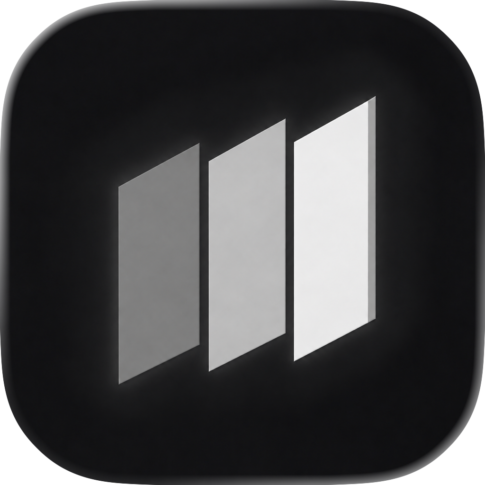

# FFFilm

Data rate, storage runtime and shutter planning for the camera you actually have on set. Native SwiftUI on iPhone, iPad and Mac, with no third-party dependencies.

Rates come from published manufacturer recording tables held in this repository, not from a generic bitrate formula.

## Features

**Recording** — camera, format and cadence in; rate and storage out.

- Data rate as GB/h or GiB/h, with the matching Mb/s bitrate.
- Storage plan: capacity for a planned duration, the card's actual capture runtime, and a warning when the plan exceeds the card.
- Direct duration entry (0.25–24 hours) with inline validation, a native stepper and 1/4/8/12-hour presets. An incomplete draft keeps the last valid result.
- Snapshot comparisons: pin up to four setups; duplicates are rejected.
- Per-camera format memory. Media and planned duration stay per-window.
- Playback duration, active image area and the calculation basis stay in a collapsed details disclosure.

**Shutter** — three modes sharing camera FPS and a user-set maximum angle.

- **Convert** — angle ⇄ exposure time, with the primary readout following the conversion direction.
- **Flicker reference** — flicker-free angles against mains (50/60 Hz), a custom optical rate, or 2–16 display refresh rates.
- **Over / undercrank** — match an exposure by keeping the angle or the time, with playback speed and an optional light check.

Preset frame rates carry their exact rational values; typed decimals stay literal.

**Camera catalog** — 33 profiles across ARRI, Sony, RED, DJI, Kinefinity and standalone Apple ProRes, with manufacturer-grouped search, reorderable favorites and per-camera recording-mode details.

**Settings** — decimal GB/TB or binary GiB/TiB, applied to rates and totals without changing bitrate or runtime. Simplified Chinese and English follow the system language, falling back to English; camera models, codec names and FPS stay in their source form.

## Film slicing (macOS only)

Open **Film** in the Mac toolbar, or press **⌘3**. Import a TIFF or experimental Flextight FFF strip, detect frame gaps or draw frames manually, then crop, rotate, reorder and export. Automatic boundaries are candidates and should be checked. Save `.fffilm` projects to resume slicing without modifying the scan.

Export current, checked or all frames as 16-bit Adobe RGB TIFF or 8-bit sRGB JPEG. Whole-strip output places rotated crops in their original slots, clipping to the slot boundaries; individual exports retain full rotated bounds. Zoom, undo/redo and batch selection remain available.

The workbench contains no film-base correction, tone, curve, histogram or preset tools. Old projects load their geometry and ignore removed grading fields; resaving omits those fields. Existing user-preset files remain untouched.

**Color management** remains for accurate input/output interpretation: embedded input profiles take precedence; untagged scans require explicit assignment or a matching RGB ICC. Floating-point previews preserve extended RGB and exports embed their output profiles. No automatic negative conversion is applied. See [color-management notes](docs/film-color-management.md).

**FFF compatibility is experimental:** ImageIO full-resolution 16-bit RGB decoding works for the tested sample, but this does not establish every proprietary variant or calibrated scanner color. Camera RAW FFF and FlexColor processing history are not supported.

## Build, run and test

Requires Xcode 26.3 or later, and iOS/iPadOS 18.6+ or macOS 15.6+. Open `FFFilm.xcodeproj`, or use:

```sh
# macOS app
xcodebuild -project FFFilm.xcodeproj -scheme FFFilm \
  -destination 'platform=macOS' build

# iOS Simulator
xcodebuild -project FFFilm.xcodeproj -scheme FFFilm \
  -destination 'platform=iOS Simulator,name=iPhone 17 Pro' build
```

```sh
# Unit tests — catalog integrity, rate tables, media planning, shutter math
xcodebuild -project FFFilm.xcodeproj -scheme FFFilm \
  -destination 'platform=macOS' -only-testing:FFFilmTests test

# UI tests — run on a simulator; the flag avoids a clone-launch flake
xcodebuild -project FFFilm.xcodeproj -scheme FFFilm \
  -destination 'platform=iOS Simulator,name=iPhone 17 Pro' \
  -parallel-testing-enabled NO -only-testing:FFFilmUITests test
```

UI tests select elements by accessibility identifier rather than visible label, so they run against any system language.

```sh
# macOS app lifecycle
script/build_and_run.sh            # build and launch
script/build_and_run.sh --verify   # confirm the process is running
script/build_and_run.sh --debug    # launch under lldb
script/build_and_run.sh --logs     # stream the unified log
```

## Catalog

`FFFilm/Catalog.json` is the source data: 33 camera profiles, 15 codecs, four media capacities (512 GB / 1 / 2 / 4 TB, decimal) and frame rates from 23.976 to 660 fps. Sensor geometry uses published millimeters wherever the manufacturer provides them.

```sh
python3 script/validate_catalog.py
```

Checks the invariants the decoder and calculation engine rely on: unique ids, rate-table keys that resolve to real camera/codec/resolution triples, finite positive rates, and geometry that stays inside the published sensor.

## Project structure

| Path | Role |
| --- | --- |
| `FFFilm/CalculatorEngine.swift` | Compatibility rules, rate lookup, media planning, active-area geometry, shutter math. |
| `FFFilm/CalculatorStore.swift` | Per-window workflow state, favorites and pinned setups. |
| `FFFilm/Models.swift` | Catalog, settings and result types. |
| `FFFilm/ContentView.swift` | The adaptive workbench. |
| `FFFilm/CameraLibraryView.swift` | Catalog search, favorites and camera details. |
| `FFFilm/QuickStartView.swift` | Camera shortcuts. |
| `FFFilm/SettingsView.swift`, `StorageUnit.swift` | Unit preference and its GB↔GiB conversion. |
| `FFFilm/MacWorkbenchToolbar.swift`, `WorkbenchComponents.swift` | Desktop toolbar and shared view primitives. |
| `FFFilm/DisplayFormat.swift`, `Localization.swift`, `PlatformClipboard.swift` | Formatting, non-view strings, clipboard. |
| `FFFilm/Catalog.json`, `Localizable.xcstrings` | Source data and localized strings. |
| `FFFilmTests/`, `FFFilmUITests/` | Test targets, run through `FFFilm.xctestplan`. |
| `design/` | App-icon sources, exports and approved artwork. |
| `script/` | Build/run, catalog validation and icon tooling. |
| `DESIGN.md`, `AGENT.md` | UI contract and working notes. |

## Product boundary

Displayed rates are video-only planning estimates. Validate camera firmware, codec settings and recording media before production use. Shutter and flicker results are theoretical models, not guarantees for LED fixtures, PWM dimming, rolling shutters or unstable supply.
